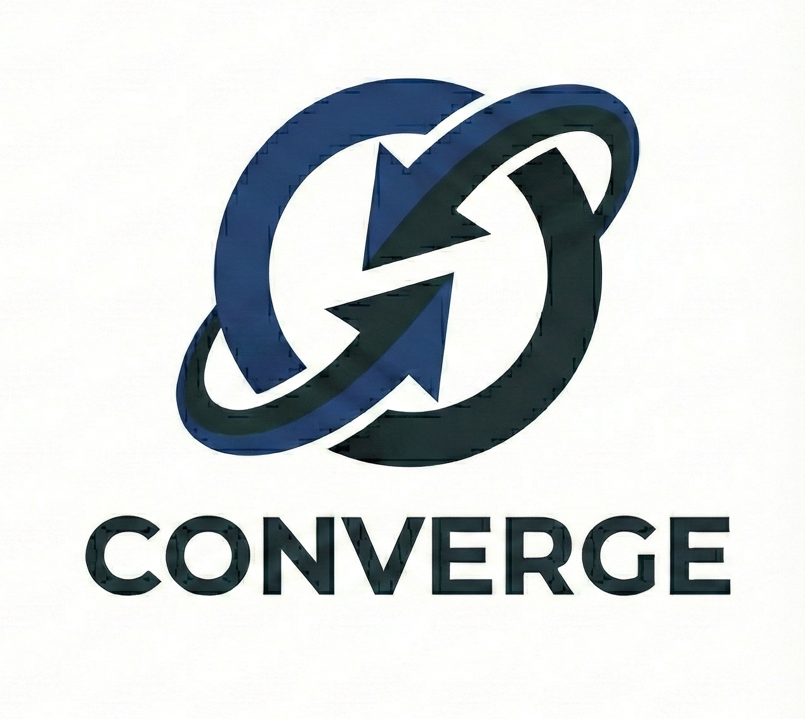

# Converge — Augmented Memory for Professional Networking ✨🤝



---

**Converge** is an AI-powered personal CRM that captures the essence of real conversations at networking events—so you can build authentic, lasting relationships instead of forgetting context 48 hours later.

---

## Demo 🎬
- **Demo video:** _(add link)_
- **Devpost:** _(add link)_

---

## Why Converge? 💡
Traditional networking tools capture *transactional* data (name/company), but miss what actually matters:
- what you discussed
- what they needed
- what you promised
- where you met
- what they looked like

Converge turns a fleeting conversation into **durable, queryable memory**.

---

## Core Features (MVP / Phase 1) ✅
- 🔐 **Authentication** (email/password, JWT sessions)
- 🎥 **Record conversations** with event context (audio + video)
- 🎧 **LiveKit audio processing**
  - transcription
  - structured profile extraction (name/company/role/topics/challenges/follow-up hooks)
  - confidence scores (high/medium/low)
- 🎞️ **Overshoot video processing**
  - face tracking + **512-d face embedding**
  - appearance + environment description
- 🧩 **Merge + store** audio + visual into a single draft profile in MongoDB Atlas
- 📝 **Approval UI**
  - highlights low-confidence fields
  - inline edits
  - approve / discard
- 🗂️ **Connections grid + detail view**
  - browse and search your network
  - view follow-up hooks and conversation context
- 🎙️ **Voice agent search** (“Who was the scout from a16z?”)
- 📈 **Analytics dashboard** (connections over time, follow-ups pending, top events)
- 💌 **Smart follow-up suggestions** (personalized messages based on real conversation)
- 🕸️ **Network graph visualization**

---

## Architecture 🏗️

### System Overview
```mermaid
flowchart LR
  A[React Frontend] <-- REST / WS --> B[Express Backend]
  B <--> C[MongoDB Atlas]
  A <-- WS Audio --> D[LiveKit]
  A <-- WS Video --> E[Overshoot]
  B --> F[ElevenLabs TTS (Stretch)]
  C --> G[Atlas Vector Search<br/>face_embedding (512)]
Data Flow (Capture → Process → Merge → Approve → Use)
Capture: device records audio + video
```

Process (parallel):

LiveKit → transcript + profile fields + confidence

Overshoot → face embedding + appearance + environment

Merge: backend merges outputs + context into a draft profile

Approve: user reviews/edits low-confidence fields → approve

Use: browse/search network, follow up (stretch: voice search + suggestions)

Tech Stack 🧰
Frontend: React (Vite recommended)

Backend: Node.js + Express

DB: MongoDB Atlas (+ Atlas Vector Search)

Audio: LiveKit (WebSocket streaming + transcription/extraction)

Video: Overshoot (WebSocket streaming + embeddings + descriptions)

TTS (stretch): ElevenLabs

LLM provider: Anthropic 

Project Structure 📁
Adjust paths to match your repo. This is the recommended layout.

bash
Copy code
converge/
  frontend/                 # React app (Vite)
    src/
    package.json

converge-mobile/            # Mobile React app (Vite)
  client/
    src/
    package.json

  backend/                  # Express API + WS handlers
    src/
      routes/
      middleware/
      services/
      ws/                   # LiveKit/Overshoot WS gateways (if proxied)
      db/
    package.json

  docs/                     # PRD, diagrams, demo assets
  README.md
Quickstart (Local Dev) ⚡
0) Prerequisites
Node.js 18+

MongoDB Atlas account + cluster

LiveKit credentials (or mocked test payloads)

Overshoot credentials (or mocked test payloads)

1) Clone + install
bash
Copy code
git clone <your-repo-url>
cd converge

# Backend
cd backend
npm install

# Frontend
cd ../frontend
npm install
2) Configure environment variables
Create .env files from the examples:

backend/.env
bash
Copy code
# MongoDB
MONGODB_URI=mongodb+srv://...

# Auth
JWT_SECRET=your-secret-key

# LiveKit
LIVEKIT_API_KEY=...
LIVEKIT_API_SECRET=...
LIVEKIT_URL=wss://...

# Overshoot
OVERSHOOT_API_KEY=...
OVERSHOOT_WS_URL=wss://...

# ElevenLabs (stretch)
ELEVEN_LABS_API_KEY=...
ELEVEN_LABS_VOICE_ID=...

# Proxycurl (stretch)
PROXYCURL_API_KEY=...

# LLM
ANTHROPIC_API_KEY=...
frontend/.env
bash
Copy code

# Backend base URL
VITE_API_BASE_URL=http://localhost:5000

---

# API Overview 🔌
Auth
Method	Endpoint	Description
POST	/api/auth/signup	Create account
POST	/api/auth/login	Login + JWT
POST	/api/auth/logout	Logout
GET	/api/auth/me	Current user

Connections (MVP)
Method	Endpoint	Description
POST	/api/connections/merge	Merge LiveKit + Overshoot outputs into draft
GET	/api/connections	List connections (supports search/filter/pagination)
GET	/api/connections/:id	Get a connection
PATCH	/api/connections/:id/approve	Approve draft with edits
DELETE	/api/connections/:id	Discard draft

Search (Stretch)
Method	Endpoint	Description
POST	/api/search/voice	Voice transcript → parsed query → results (+ TTS)
POST	/api/search/text	Text query fallback

Analytics (Stretch)
Method	Endpoint	Description
GET	/api/analytics/overview	Totals + key metrics
GET	/api/analytics/industry-breakdown	Group by industry
GET	/api/analytics/connections-over-time	Trend line
GET	/api/analytics/top-events	Events ranked
GET	/api/analytics/relationship-types	Breakdown

--- 

Database Schema (High-Level) 🗄️
users
email (unique), password_hash, name

settings (default_event, voice_agent_enabled)

connections
status: draft | approved | archived

identity: name/company/role (value + confidence + source)

visual: face_embedding (512), appearance, environment

audio: topics, challenges, follow_up_hooks, transcript_summary

context: event, location, first_met

review flags: needs_review, fields_needing_review

interactions
logs meetings/follow-ups with timestamps + summary snapshots
